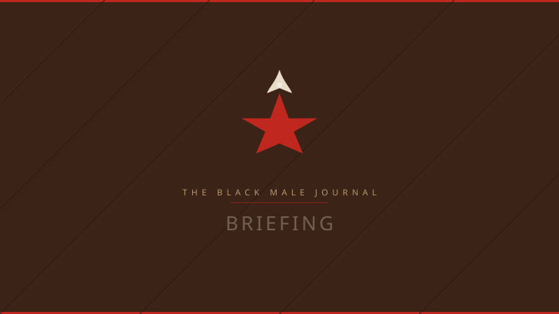

# BMJ visual and verbal identity — SSOT index

This document is the **documentation single source of truth** for *where* identity lives and *what files* must stay aligned. Numeric colors, CSS variables, and Tailwind mirrors are **not** redefined here as a second authority — see the table below.

---

## Authority chain (governance I-1)

| What | Canonical file (truth) | This doc + HTML gallery |
|------|--------------------------|-------------------------|
| **Color tokens & semantic CSS variables** (`--bmj-*`, surfaces, text, borders) | [`src/styles/brand.css`](../../src/styles/brand.css) | Describes and links |
| **Tailwind color names** (`bg-bmj-red`, `text-bmj-amber`, …) | [`tailwind.config.ts`](../../tailwind.config.ts) | Hex must **mirror** `brand.css` (opacity modifiers require hex in Tailwind — see root `CLAUDE.md`) |
| **Lens → UI classes** (badges, borders) | [`src/lib/lens-theme.ts`](../../src/lib/lens-theme.ts) | Lens table below matches shipped UI |
| **Verbal identity** (name, tagline, default author, public emails) | [`src/lib/seo.ts`](../../src/lib/seo.ts) | Quoted below for convenience only |
| **Placeholder image paths** | [`src/lib/placeholders.ts`](../../src/lib/placeholders.ts) → `public/placeholders/*.svg` | Previews below |
| **Logo / favicon / OG art files on disk** | `public/logos/*`, `public/favicon.svg`, `public/og-image.svg` | Shown below |
| **Rules humans must not break** (no gradients in brand components, type roles, etc.) | [invariants.md](invariants.md) | Complements this index |

**If anything disagrees:** **`brand.css` wins** for tokens until you intentionally change it **and** update `tailwind.config.ts` and this index in the same maintenance pass. Run `/brand-check` or the project’s drift hook where applicable.

---

## Verbal identity (mirror of `src/lib/seo.ts`)

| Field | Value |
|-------|--------|
| Site name | The Black Male Journal |
| Tagline | Study Well. Speak the Truth. Navigate the Consequences. |
| Default author | The Chairman |

Public emails and support handles are listed in **`seo.ts`** (`CONTACT_EMAILS`, `SUPPORT_PAYMENT_METHODS`, `SUPPORT_PATREON_URL`) and in [../ops/chairman-consistency-reference.md](../ops/chairman-consistency-reference.md).

---

## Lenses (content taxonomy + accent color in UI)

Each piece of content uses **exactly one** lens. UI accents come from `LENS_THEMES` (Tailwind `bmj-*` colors).

| Lens key | Reader-facing label (in UI) | Accent (Tailwind) | Hex (from `tailwind.config.ts`) |
|----------|-----------------------------|-------------------|----------------------------------|
| `health` | Health/Wellness | `bmj-amber` | `#C8852A` |
| `politics` | Politics/Law | `bmj-red` | `#C0281F` |
| `culture` | Culture/Ideology | `bmj-tan` | `#B8986A` |
| `entertainment` | Entertainment/Technology | `bmj-purple` | `#554978` |
| `business` | Business/Finance | `bmj-olive` | `#416100` |

---

## Logos, favicon, and social preview art

**Shipped files in `public/` (reference visuals):**

| Role | Path |
|------|------|
| Primary logo (color SVG) |  `public/logos/primary-color.svg` |
| Submark (color SVG) |  `public/logos/submark-color.svg` |
| **Monogram (BMJ)** |  `public/logos/monogram-color.svg` |
| **B Mark (compact)** |  `public/logos/b-mark.svg` |
| **Wordmark (light)** |  `public/logos/wordmark-light.svg` |
| **Wordmark (dark)** |  `public/logos/wordmark-dark.svg` |
| Favicon variant (red) |  `public/logos/favicon-red.svg` |
| Site favicon |  `public/favicon.svg` |
| Default OG image |  `public/og-image.svg` |

**Logo Usage Matrix:**

| Context | Asset | Notes |
|---------|-------|-------|
| Website header | Primary logo or Wordmark | Full brand presence |
| Favicon/App icon | B Mark or Monogram | 16–64px recognition |
| Social avatars | Monogram | Square format |
| Email signature | Submark | Compact horizontal |
| Print masthead | Wordmark (dark) | On cream/light paper |
| Merchandise | Any variant | Context-dependent |

*If images do not render in your viewer, open the repo in a browser-based IDE or use a Markdown preview tool.*

---

## Content-type placeholders (`PLACEHOLDERS` in code)

| Type | File | Preview |
|------|------|---------|
| Article | `public/placeholders/article.svg` |  |
| Briefing | `public/placeholders/briefing.svg` |  |
| Course | `public/placeholders/course.svg` |  |
| Handbook | `public/placeholders/handbook.svg` |  |
| Dispatch | `public/placeholders/dispatch.svg` |  |
| Download | `public/placeholders/download.svg` |  |
| Generic cover | `public/placeholders/cover.svg` |  |

---

## Palette reference

- **[bmj-palettes-reference.png](bmj-palettes-reference.png)** — palette comparison sheet.

> Archived HTML galleries (`visual-ssot.html`, `color-system.html`) are in `../archive/2026-04-08-cleanup/brand/`.

---

## Related documentation

| Document | Purpose |
|----------|---------|
| [art-direction-spec.md](art-direction-spec.md) | Visual tone and art direction principles |
| [invariants.md](invariants.md) | Design rules and constraints |
| `/brand` route in app | Interactive brand showcase page |
| `src/lib/images.ts` | Centralized image utilities, logo paths, and sizing presets |

---

## Revision log

| Date | Note |
|------|------|
| 2026-04-08 | Added comprehensive brand redesign strategy; new logo variants (monogram, B mark, wordmarks); interactive brand showcase page at `/brand`; image asset organization documentation; centralized image utilities (`src/lib/images.ts`) |
| 2026-03-31 | Initial VISUAL-SSOT index + visual-ssot.html gallery; I-1 authority table. |
